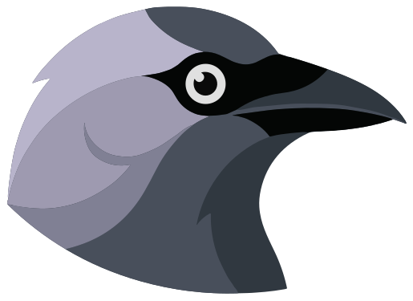
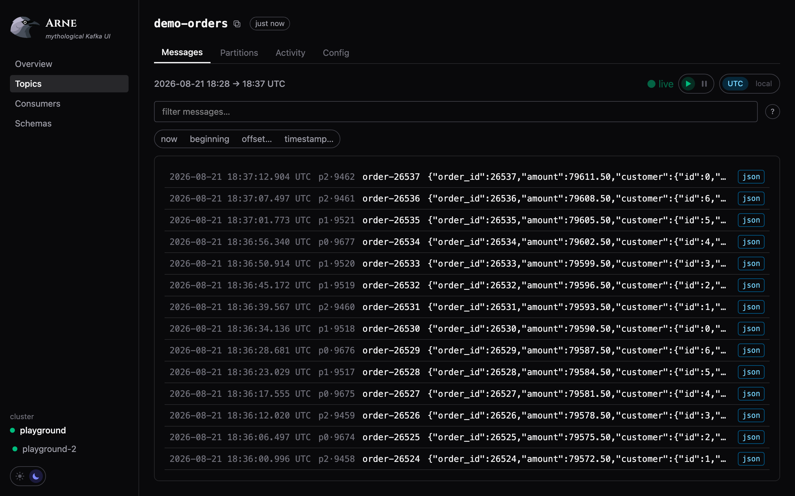
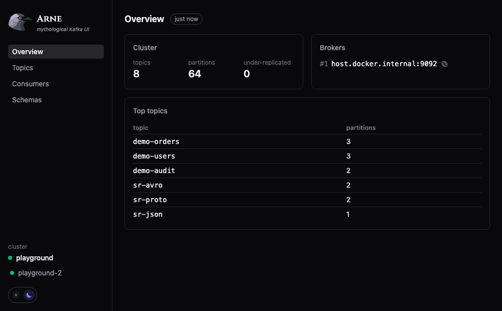
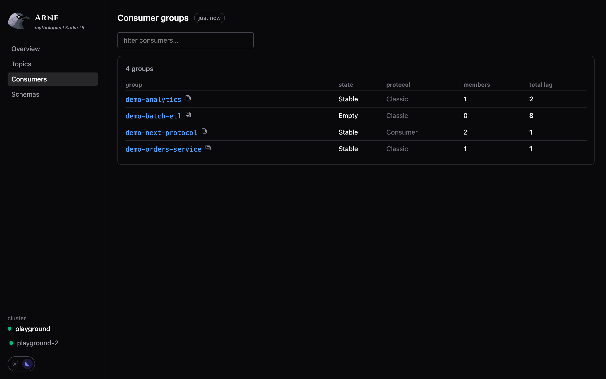
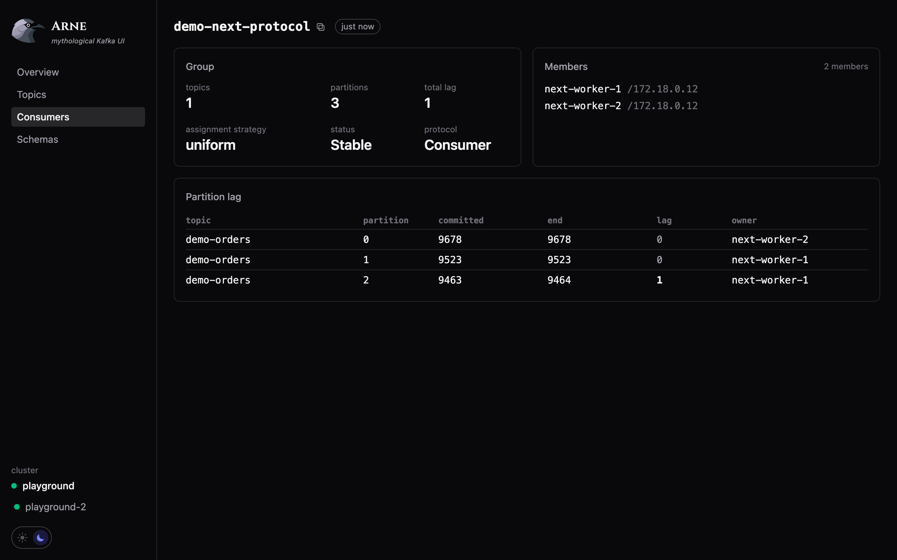

<div align="center">



# Arne

**A fast, honest Kafka UI.**

Read-only monitoring and message lookup that tells you exactly what it knows,
and when it measured it.

[](https://github.com/simoexpo/arne/actions/workflows/ci.yml)
[](https://hub.docker.com/r/simoexpo/arne)
[](https://hub.docker.com/r/simoexpo/arne)
[](https://www.rust-lang.org/)
[](https://react.dev/)




</div>

---

## Why another Kafka UI

Every Kafka UI can list your topics. The problems start with everything else:
pages that take ten seconds to paint, a "messages" count that is really a
subtraction of two offsets nobody sampled at the same time, lag that quietly
omits the partitions it could not read, and dashboards that keep showing you a
number long after it stopped being true.

Arne is built on two rules.

**It never lies.** Every metric carries the timestamp of the sample it came
from. A total that cannot be computed completely says so — lag summed from a
partial snapshot renders as `≥ 4.2k`, never as a confident total. A partition
that no live member owns is labelled `unassigned`, because lag nobody is
draining is the thing you actually need to see. A message that fails to decode
appears in the results, loudly, instead of vanishing.

**It is gentle with your brokers.** Every broker call is demand-driven, shared
and bounded. Load follows the refresh policy — never the number of open tabs,
never the size of the cluster. An idle Arne makes **zero** broker calls, and
that is asserted by tests rather than hoped for.

<div align="center">

</div>

## Quick start

```bash
cat > config.yaml <<'YAML'
clusters:
  - name: local
    bootstrap: localhost:9092
server: { port: 8080 }
YAML

docker run -p 8080:8080 -v $(pwd)/config.yaml:/etc/arne/config.yaml simoexpo/arne:latest
```

Open <http://localhost:8080>. That is the whole installation: one container, no
database, no agent, no sidecar. State lives in Kafka or in memory, nowhere else.

SASL, TLS and Schema Registry are configured in the same file — see
[`config.example.yaml`](config.example.yaml). Passwords can be given as
`${ENV_VAR}` and are redacted from every log line and error message.

## What it does

|  | |
|---|---|
| **Overview** | Cluster health, brokers, and the topics worth looking at first |
| **Topics** | Partitions, replication, and the worst partition's in-sync count — flagged when ISR < RF |
| **Messages** | Browse, filter and live-tail. Jump to an offset, a timestamp, the beginning or now |
| **Filtering** | `key=`, `value:`, JSON paths (`value.customer.id=42`), negation, numeric comparison, with autocomplete |
| **Decoding** | JSON, Avro, Protobuf and Schema Registry-framed payloads — failures shown, never skipped |
| **Consumers** | Groups, state, protocol, members and lag; per-partition ownership, idle members, unassigned partitions |
| **Schemas** | Subjects, versions, compatibility level and a compatibility checker |
| **Multi-cluster** | As many as you like in one config; one broken cluster never blanks the page |

<div align="center">


</div>

### Read-only, on purpose

v1 observes and never mutates: no offset resets, no topic creation, no message
production. Point it at production without a second thought. Consumer-group
operations are the natural next step, and the architecture is built not to
preclude them.

### Kafka 4 and KIP-848

Groups using the new consumer protocol are reported correctly — state, members,
assignor and per-partition ownership. That matters more than it sounds: the
legacy `DescribeGroups` API reports such a group as `Dead` with no members
*while it is happily consuming*, which is what most tools still show you.

## How it stays fast

- **One binary.** Rust and axum, with the React frontend embedded via
  `rust-embed`. No web server to configure, no node process in production.
- **Nothing polls in the background.** Throughput sampling, lag, group
  descriptions — all triggered by a request that needs them, all cached per
  cluster and shared by every viewer.
- **No request scales with the cluster.** Not with topics, partitions or
  groups. Lag is fetched for the rows on screen and nothing else.
- **Bindings for what the client library skipped.** `DescribeCluster`,
  `ListOffsets`, `ListConsumerGroups`, `DescribeConsumerGroups` and
  `ListConsumerGroupOffsets` are bound directly to librdkafka, replacing
  per-broker fan-outs and per-partition loops with single batched calls.
- **Costs are measured, not assumed.** A diagnostic endpoint exposes what
  librdkafka counted itself sending, per broker and per API, so a page's cost
  is a number rather than an opinion.

## Development

Requires Rust (stable), Node 20.19+, Docker, and optionally
[`just`](https://github.com/casey/just).

```bash
cp config.example.yaml config.yaml   # then point it at your cluster(s)

just dev              # backend on :8080 + vite dev server (proxies /api to it)
just test             # backend + frontend test suites
just lint             # clippy + frontend build
just docker           # build the production image
just playground       # local Kafka + schema registry + demo producers
just smoke            # end-to-end smoke check (needs Google Chrome)
```

Without `just`:

```bash
(cd backend && cargo run -- ../config.yaml) &   # dev
(cd frontend && npm run dev) &

cd backend && cargo test                        # test
cd frontend && npx vitest run

cd backend && cargo clippy --all-targets -- -D warnings   # lint
cd frontend && npm run build

docker build -t arne-kafka-ui:dev .             # image
docker compose -f docker-compose.dev.yml up -d  # playground
node scripts/smoke.mjs                          # smoke
```

### The playground

`just playground` brings up two independent local Kafka brokers (ports 9092 and
9093), a schema registry against the first, and demo producers writing JSON to
`demo-orders` (`cleanup.policy=delete`), `demo-users` (compact) and
`demo-audit` (compact+delete), plus consumer groups — including one on the
KIP-848 protocol with two members — so every page has something real to show.
Point `config.yaml` at `localhost:9092` and/or `localhost:9093`.

The advertised listeners assume Docker Desktop, which resolves
`host.docker.internal`. On plain Docker Engine on Linux, add
`extra_hosts: ["host.docker.internal:host-gateway"]` to the `kafka` and
`kafka2` services, or give each broker a dual listener instead.

### How this codebase works

- **Always TDD.** Test first, watch it fail, then implement. The tests are the
  specification; there is no design document to drift out of date.
- **The code is the documentation.** Reasoning lives next to what it explains,
  where it cannot rot separately.
- Conventions and product principles: [`CLAUDE.md`](CLAUDE.md).

## Contributing

Issues and pull requests are welcome. Please keep the TDD rule and run
`just test && just lint` before opening a PR.

## Credits

Wordmark font: [Cinzel](https://fonts.google.com/specimen/Cinzel) by Natanael
Gama, SIL Open Font License 1.1, bundled via `@fontsource`.

Arne is named after a bird.
